<h1 align="center"><strong>Project: Website quản lý bán nước uống</strong>  </h1>

<h2>Thông tin cá nhân</h2>

👤 **Họ tên:** Nguyễn Minh Đức  
🎓 **Mã sinh viên:** 23010171

## 📝 Mô tả dự án

Website quản lý việc bán nước uống với các tính năng quản lý đồ uống, người mua và đơn hàng.  
Dự án sử dụng Laravel, MySQL,...

## 🧰 Công nghệ sử dụng

-   PHP (Laravel Framework)
-   Laravel Breeze
-   MySQL (Aiven Cloud)
-   Blade Template
-   ...

# Một số Code chính minh họa

## Model

<strong>Drink Model</strong>

```php
class Drink extends Model
{
    use HasFactory;

    /**
     * The attributes that are mass assignable.
     *
     * @var array<string>
     */
    protected $fillable = [
        'name',
        'type',
        'price',
    ];
}

```

<strong>Customer Model</strong>

```php
class Drink extends Model
{
    use HasFactory;

    /**
     * The attributes that are mass assignable.
     *
     * @var array<string>
     */
    protected $fillable = [
        'name',
        'type',
        'price',
    ];
}
```

<strong>Order Model</strong>

```php
class Order extends Model
{
    use HasFactory;

    /**
     * The attributes that are mass assignable.
     *
     * @var array<string>
     */
    protected $fillable = [
        'customer_id',
        'drink_id',
        'quantity',
        'total_price',
    ];

    /**
     * Get the customer that owns the order.
     */
    public function customer()
    {
        return $this->belongsTo(Customer::class);
    }

    /**
     * Get the drink that belongs to the order.
     */
    public function drink()
    {
        return $this->belongsTo(Drink::class);
    }
}

```

## Controller

<strong>Drink Controller</strong>

```php
    class DrinkController extends Controller
{
    public function index()
    {
        $drinks = Drink::all(); // Hoặc phân quyền theo user nếu cần
        return view('drinks.index', compact('drinks'));
    }

    public function create()
    {
        return view('drinks.create');
    }

    public function store(Request $request)
    {
        $request->validate([
            'name' => 'required',
            'type' => 'nullable',
            'price' => 'required|numeric',
        ]);

        Drink::create($request->only(['name', 'type', 'price']));

        return redirect()->route('drinks.index')->with('success', 'Drink created successfully.');
    }

    public function show(Drink $drink)
    {
        return view('drinks.show', compact('drink'));
    }

    public function edit(Drink $drink)
    {
        return view('drinks.edit', compact('drink'));
    }

    public function update(Request $request, Drink $drink)
    {
        $request->validate([
            'name' => 'required',
            'type' => 'nullable',
            'price' => 'required|numeric',
        ]);

        $drink->update($request->only(['name', 'type', 'price']));

        return redirect()->route('drinks.index')->with('success', 'Drink updated successfully.');
    }

    public function destroy(Drink $drink)
    {
        $drink->delete();

        return redirect()->route('drinks.index')->with('success', 'Drink deleted successfully.');
    }
}
```

<strong>Customer Controller</strong>

```php
    class CustomerController extends Controller
{
    public function index()
    {
        $customers = Customer::all();
        return view('customers.index', compact('customers'));
    }

    public function create()
    {
        return view('customers.create');
    }

    public function store(Request $request)
    {
        $request->validate([
            'name' => 'required',
            'phone' => 'required|unique:customers,phone',
            'address' => 'nullable',
        ]);

        Customer::create($request->only(['name', 'phone', 'address']));

        return redirect()->route('customers.index')->with('success', 'Thêm khách hàng thành công.');
    }

    public function edit(Customer $customer)
    {
        return view('customers.edit', compact('customer'));
    }

    public function update(Request $request, Customer $customer)
    {
        $request->validate([
            'name' => 'required',
            'phone' => 'required|unique:customers,phone,' . $customer->id,
            'address' => 'nullable',
        ]);

        $customer->update($request->only(['name', 'phone', 'address']));

        return redirect()->route('customers.index')->with('success', 'Cập nhật khách hàng thành công.');
    }

    public function destroy(Customer $customer)
    {
        $customer->delete();

        return redirect()->route('customers.index')->with('success', 'Xóa khách hàng thành công.');
    }
}
```

<strong>Order Controller</strong>

```php
    class OrderController extends Controller
{
    public function index()
    {
        $orders = Order::with(['customer', 'drink'])->get();
        return view('orders.index', compact('orders'));
    }

    public function create()
    {
        return view('orders.create');
    }

    public function store(Request $request)
    {
        $validated = $request->validate([
            'customer_id' => 'required|exists:customers,id',
            'drink_id' => 'required|exists:drinks,id',
            'quantity' => 'required|integer|min:1',
            'total_price' => 'required|numeric|min:0',
        ]);

        Order::create($validated);
        return redirect()->route('orders.index')->with('success', 'Đơn hàng được tạo!');
    }

    public function show(Order $order)
    {
        return view('orders.show', compact('order'));
    }

    public function edit(Order $order)
    {
        return view('orders.edit', compact('order'));
    }

    public function update(Request $request, Order $order)
    {
        $validated = $request->validate([
            'customer_id' => 'required|exists:customers,id',
            'drink_id' => 'required|exists:drinks,id',
            'quantity' => 'required|integer|min:1',
            'total_price' => 'required|numeric|min:0',
        ]);

        $order->update($validated);
        return redirect()->route('orders.index')->with('success', 'Đơn hàng được cập nhật!');
    }

    public function destroy(Order $order)
    {
        $order->delete();
        return redirect()->route('orders.index')->with('success', 'Đơn hàng được xóa!');
    }
}
```

## View

<strong>
    Cấu trúc chính của view
</strong>

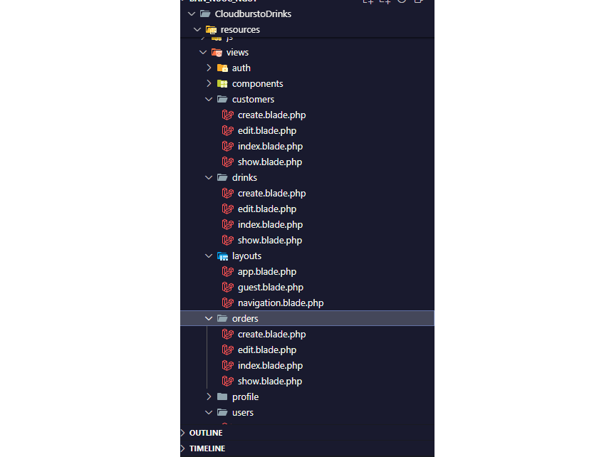


# Security Setup

<strong>
    Sử dụng @csrf để chống tấn công CSRF
</strong>

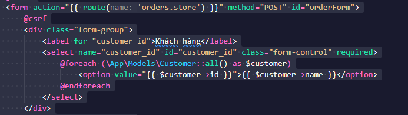

<strong>
    Chống tấn công XSS  
</strong>
    Validation Ràng buộc dữ liệu giúp ngăn chặn các input độc hại<br>
    Ví dụ method NoteController@store
</strong>

<strong>
    Query Builder Protection chống SQL Injection<br>
    Sử dụng các query builder method có sẵn trong laravel thay vì các câu lệnh query sql thuần túy<br>
</strong>

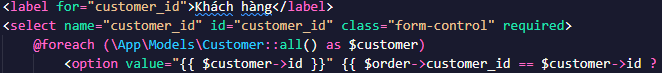

<strong>
    Middleware bảo mật
    Xử dụng các middleware auth, verified, throttle của laravel
    Ví dụ: file routes/web.php
</strong>

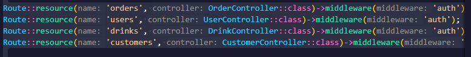  

<strong>
    Authorization<br>
    Ví dụ: Authorization chỉ admin được update tất cả mọi người<br>
<br>
</strong>


<strong>
    Luôn sử dụng phiên bản Laravel mới nhất để đảm bảo ứng dụng nhận được các bản vá bảo mật, cải tiến hiệu năng và các tính năng mới nhất từ cộng đồng phát triển
</strong>

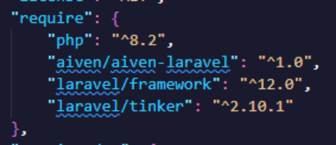


# Link

## Github link

`[https://github.com/Phel-deLunari/Cloudburst_Drink]`

## Public Web (deployment) link

Sẽ phát triển trong tương lai

# Một số hình ảnh chức năng chính

## Xác thực người dùng <\<Breeze>\>

<strong>Trang đăng nhập</strong>

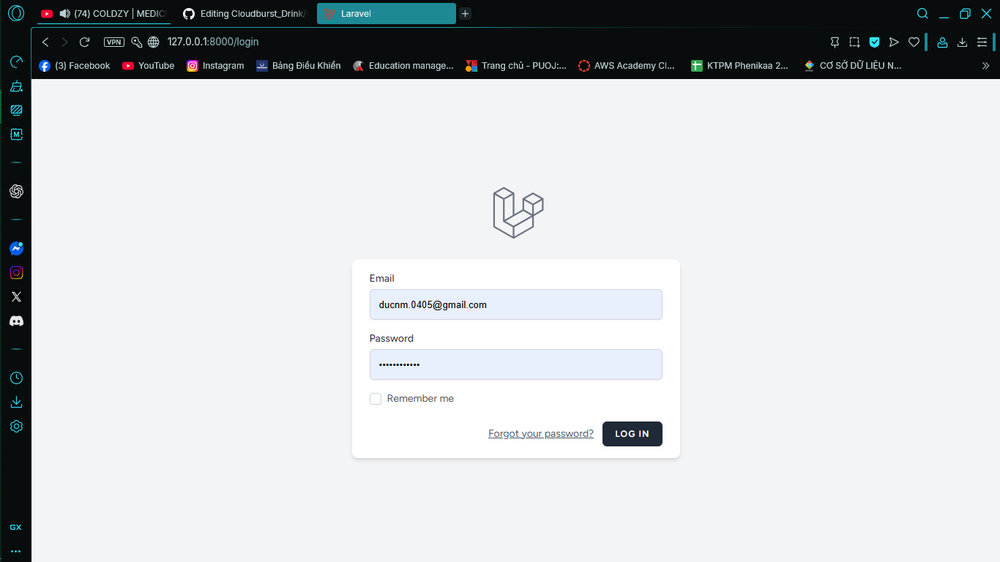

## Trang chính

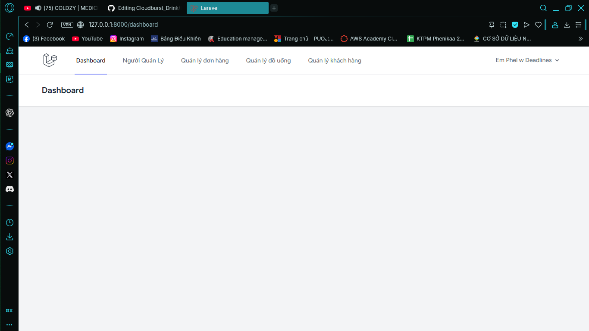

## CRUD Drink

<strong>Create Drink</strong>

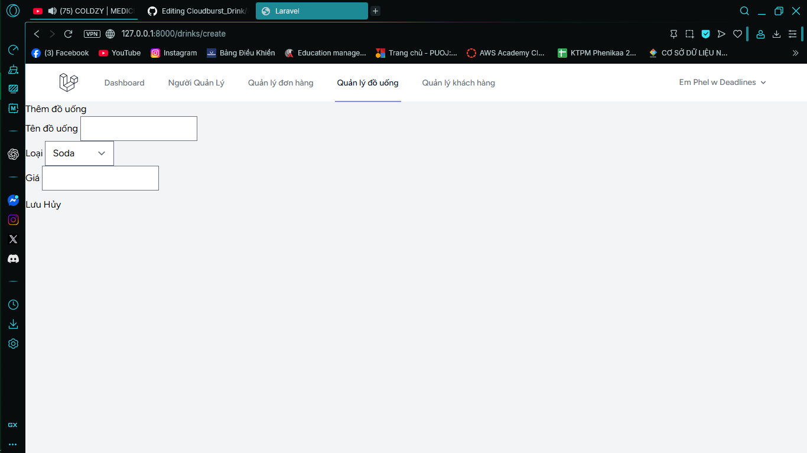

<strong>Delete and update drink</strong>

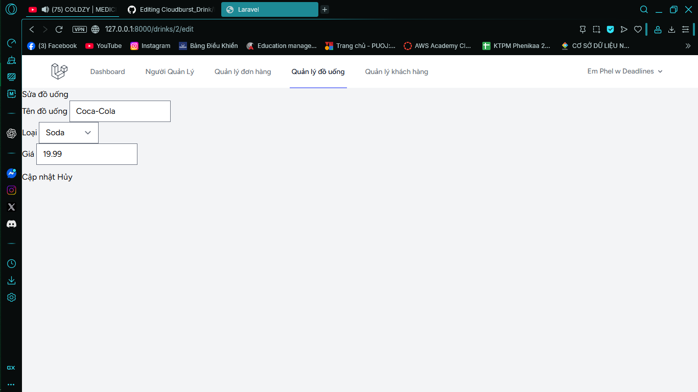

## CRUD Customer

<strong>Create Customer</strong>


<strong>Delete and update customer</strong>


## CRUD Order

<strong>Create Order</strong>

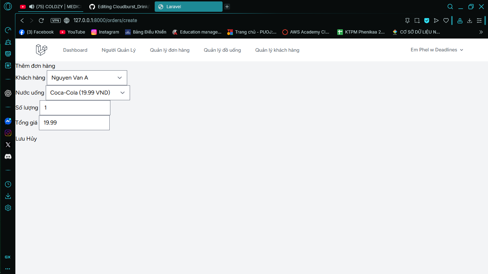

<strong>Delete and update order</strong>

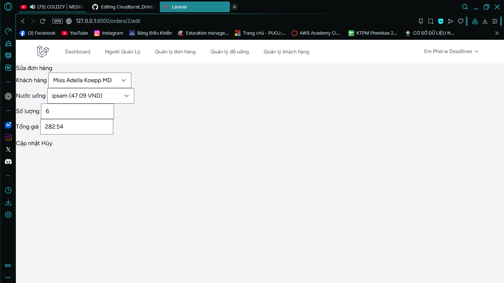

# License & Copy Rights

The Laravel framework is open-sourced software licensed under the [MIT license](https://opensource.org/licenses/MIT).
